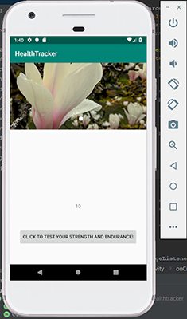
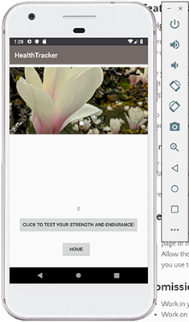
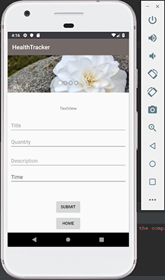
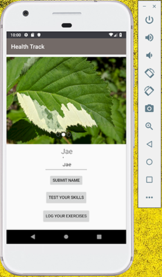

#Health Tracker 

## Day One Features:
1. Finger Exercises: Build finger strength and endurance with a button clicking exercises that displays the number of times the button has been clicked.
2. Inspiring Image Carousel: Display inspiring images and captions at the top of the page. Allow users to cycle through images with next and previous buttons, display image numbers.

## Day Two Features:
1. Navigation: Move the exercise to its own page with buttons to navigate two and back.
2. Styling: Apply consistent styling to all pages. 

## Day Three Features:
1. Database Setup: Set up a DB to contain exercise data (title, quantity, description, timestamp).
2. Display Diary: Add a new activity that has a diary view (temporary TextView for now).
3. Add to Diary: Add a form to allow users to enter data. Submitting should store data in DB. 

## Day Four Features:
1. Replace the TextView of the exercise diary with a RecyclerView.
2. Write an Adapter class to interact with the database. 
3. Ensure that displayed data is updated when the user adds an entry.

## Day Five Features:
1. Espresso: Add Espresso tests for all activities (click exercise, image carousel, and diary entries). 
2. SharedPrefs: Ensure that the user name is displayed throughout the app and modify the homepage to display key stats, like exercise count and visits to the homepage.

## Day Six Features:
1. Backend: Create a <a href="https://github.com/JessZuchowski/backend_healthtracker/tree/master/src"> Spring Backend</a> that includes a replica of the exercise diary model. Create a POST and GET route to allow users to create new exercise entries and to work with the database. 
2. Android: In addition to new user exercise entries being added to the local database, it should also POST to the server.  

## Day Seven Features:
1. Strings: Refactor the app so that it can be translated into multiple languages. Use the strings.xml file to remove all hardcoded strings.
2. Location: Add the ability for users to attach their location to an exercise entry. Display the location within the ListView.

## References:
1. <a href="https://www.4tocode.com/create-button-click-increment-counter-in-android/"> Click Counter </a>
2. <a href="https://github.com/sayyam/carouselview"> Image Carousel </a>